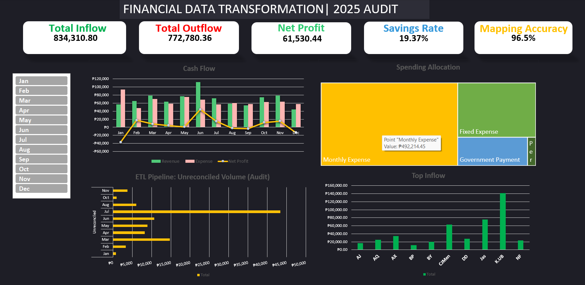
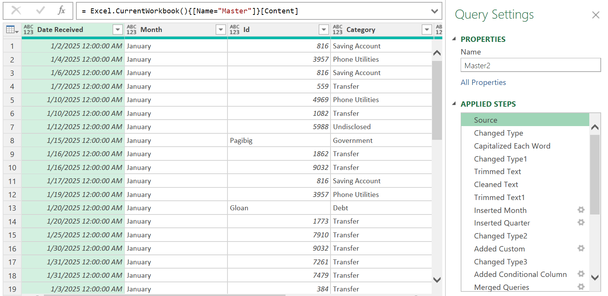
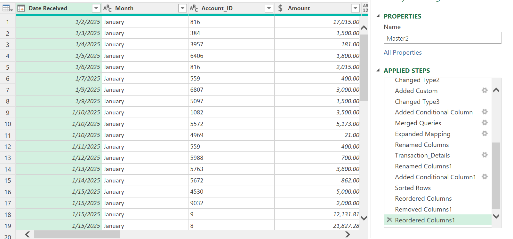
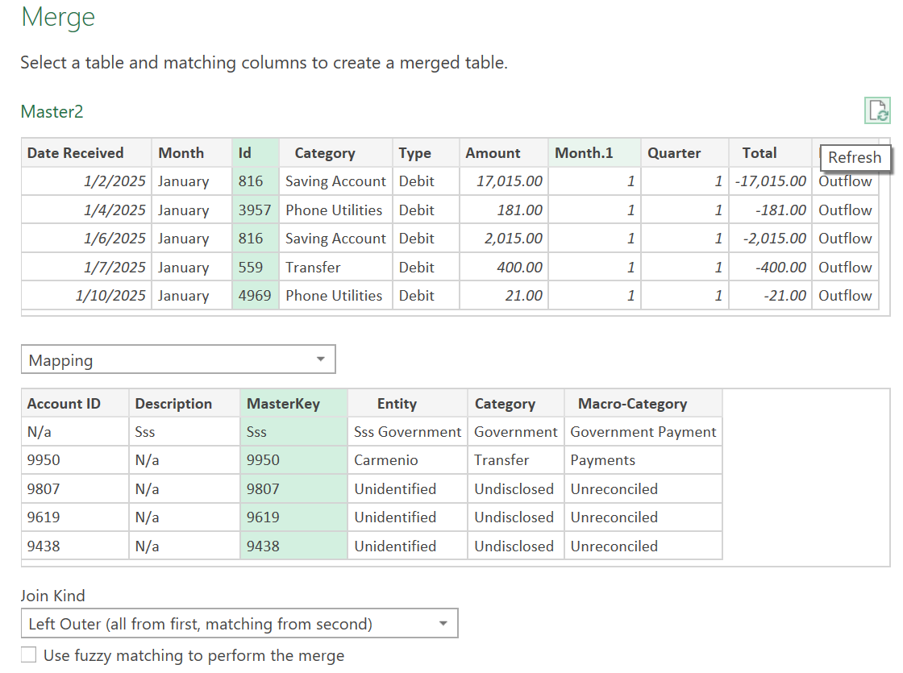

# Finance-Data-Transformation-2025
End-to-end financial data transformation project using Excel and Power Query to clean, map, and analyze 12 months of transaction data for actionable fiscal insights.
# Finance Data Transformation Project 2025

## 📌 Project Overview
This project serves as a comprehensive financial data pipeline designed to transform fragmented personal transaction logs into a centralized, analytical dataset. The goal was to move beyond simple bank statements to achieve full visibility into net worth, actual revenue, and savings discipline for the fiscal year 2025.

## 🚀 How I Started the Project
The project began with the need to consolidate data from multiple digital wallets and bank accounts. 
1. **Data Ingestion:** Exported raw transaction history (CSVs) from various financial institutions.
2. **Standardization:** Developed a `Master` dataset to unify disparate date formats, transaction descriptions, and currency values.
   
   
4. **Entity Mapping:** Built a custom `Mapping` table to translate obscure bank IDs and merchant codes into recognizable entities (e.g., converting ID `8652` to "Phone Utilities").

## 🛠 Problems Encountered
* **Transfer Inflation:** Initial reports showed artificially high income due to internal transfers between accounts. I had to implement a filtering logic to isolate "True Revenue."
* **Unidentified Transactions:** Several transactions lacked clear descriptions. I addressed this by creating an iterative mapping process to reduce "Unreconciled" data points.
* **Negative Flow Logic:** Standardizing "Debits" vs "Credits" across different bank exports required a unified sign-convention to ensure accurate Net Profit calculations.

## 📊 Key Insights & Data Analysis
* **Financial Health:** The project reconciled a total inflow of **834,310.80** against an outflow of **772,780.36**, resulting in a net positive position of **61,530.44**.
* **Revenue Drivers:** By isolating "True Revenue," the analysis identified **Jas (75,600)** and **CJMen (63,000)** as the primary external income contributors.
* **Spending Discipline:** Discretionary personal spending was kept extremely lean at **9,967.00**, while the majority of outflows were directed toward Monthly Expenses (**492,214.45**) and Fixed Costs.
* **Savings Performance:** Maintained a robust average **19.37% saving rate**, with a peak performance of **25.72%** in August.

## 🧮 Formulas Used
To drive the dashboard, the following logic was applied:

* **Total Flow:**
  $$Total = \text{IF}(Type = "Debit", Amount \times -1, Amount)$$

* **True Revenue:**
  $$True\ Revenue = \sum Income - \sum Internal\ Transfers$$

* **Saving Rate:**
  $$Saving\ Rate = \frac{Monthly\ Savings}{True\ Revenue}$$

## 🏁 Project Conclusion
The final output is a structured, "clean" dataset ready for advanced BI tools. By implementing this ETL (Extract, Transform, Load) process, I successfully turned 12 months of raw financial noise into a clear narrative of fiscal responsibility and growth. The project now provides a scalable template for future annual financial reviews.

---
**Tech Stack:** Microsoft Excel (Power Query), Data Modeling, Markdown documentation.
